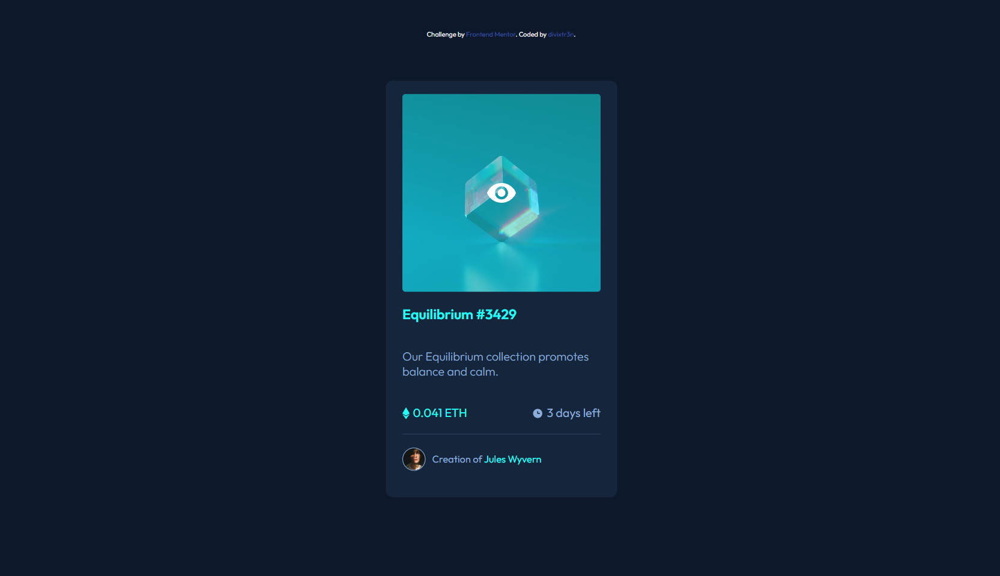
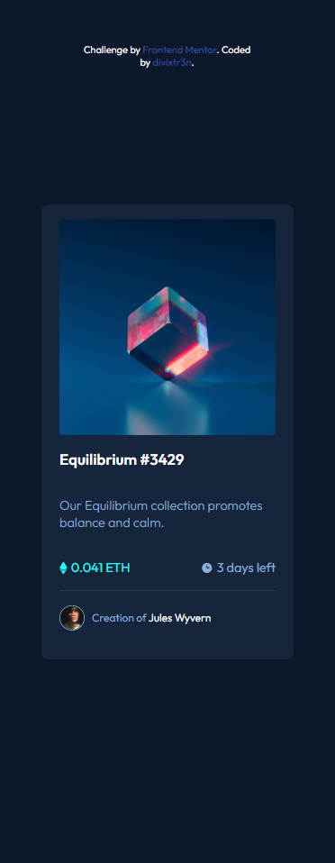
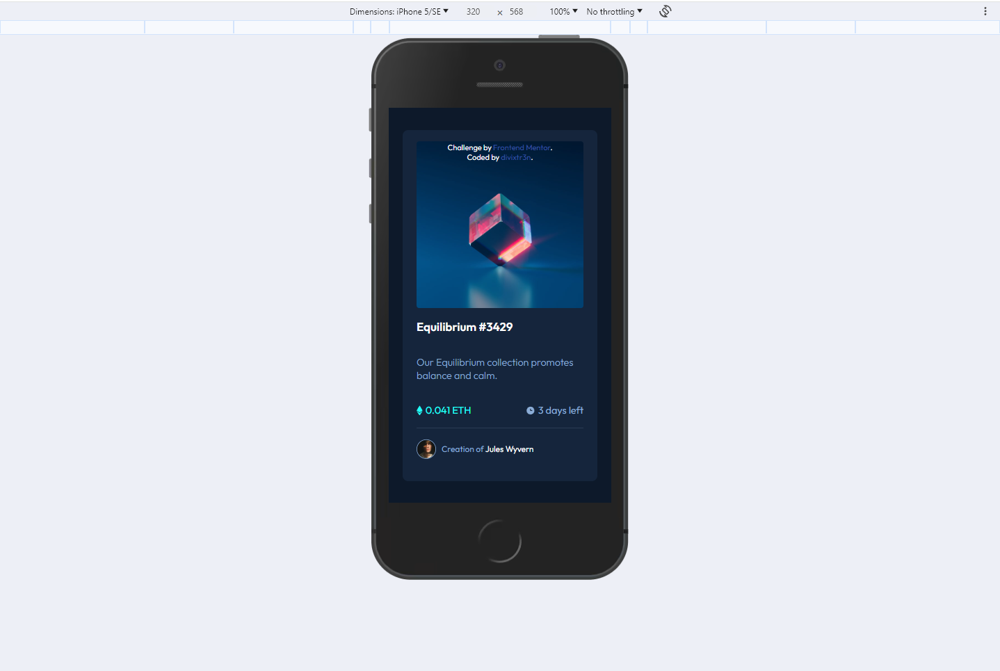

# Frontend Mentor - NFT preview card component solution

This is a solution to the [NFT preview card component challenge on Frontend Mentor](https://www.frontendmentor.io/challenges/nft-preview-card-component-SbdUL_w0U). Frontend Mentor challenges help you improve your coding skills by building realistic projects.

## Table of contents

- [Overview](#overview)
  - [The challenge](#the-challenge)
  - [Screenshot](#screenshot)
- [My process](#my-process)
  - [Built with](#built-with)
  - [What I learned](#what-i-learned)
  - [Continued development](#continued-development)
- [Author](#author)
- [Acknowledgments](#acknowledgments)

**Note: Delete this note and update the table of contents based on what sections you keep.**

## Overview

### The challenge

Users should be able to:

- View the optimal layout depending on their device's screen size
- See hover states for interactive elements

### Screenshot


Desktop preview


Desktop preview with hover


Mobile preview 375px width breakpoint


Iphone 5 preview

## My process

### Built with

- Semantic HTML5 markup
- CSS custom properties
- Flexbox
- Mobile-first workflow

### What I learned

I'm learned to,
Using div structure with flexbox for more elastic layout,
better styling by pure css without prepared components

```html
 
      <div class="nft-shadow"></div>
    </div>

      <div class="card-body">
        <div class="card-title">
          <h3>Equilibrium #3429</h3>
        </div>
        <div class="card-info">Our Equilibrium collection promotes balance and calm.</div>

        <div class="numbers">

          <div class="crypto-container">
            <div class="crypto-icon"></div>
            <div class="eth-count">
              <p>0.041 ETH</p>
            </div>
          </div>

          <div class="clock-container">
            <div class="clock-icon"></div>
            <div class="time-count">
              <p>3 days left</p>
            </div>
```

```css
.card-box {
	padding: 20px;
	display: flex;
	flex-direction: column;
	justify-content: flex-start;
	align-items: center;
	width: 350px;
	border-radius: 10px;
	background-color: hsl(216, 50%, 16%);
}

.nft-img {
	position: relative;
	height: 300px;
}

.card-img-top {
	width: 300px;
	border-radius: 5px;
}

.nft-shadow:hover {
	opacity: 1;
}

.nft-shadow {
	height: 100%;
	width: 100%;
	position: absolute;
	left: 0;
	top: 0;
	background-color: hsla(178, 100%, 50%, 0.507);
	border-radius: 5px;
	z-index: 1;
	background-image: url(../images/icon-view.svg);
	background-repeat: no-repeat;
	background-position: center;
	opacity: 0;
	transition: opacity 0.3s;
}
```

### Continued development

In the future projects i want learn and use more advanced css for creating layout, learn simple javascript for animations or new functions in web development.

## Author

- GitHub - [@divixtr3n](https://github.com/)
- Frontend Mentor - [@divixtr3n](https://www.frontendmentor.io/profile/yourusername)

## Acknowledgments

First the most important thing is: arrange html structure.

Second tip is: keep your project organized.
